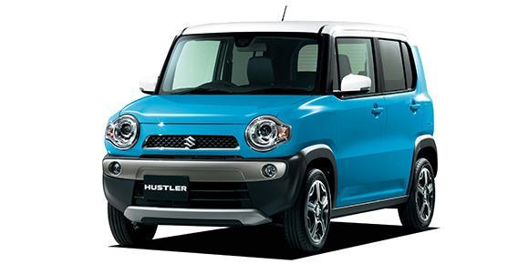
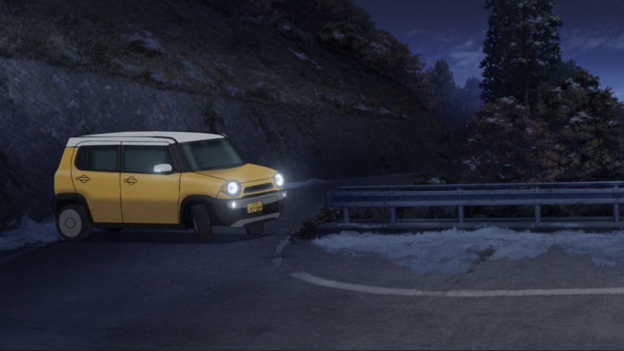

This is my first post on my new testing blog! Still basic but it can grow up again...

I'm sure I'll write a lot more interesting things in the future.

Oh, and here's a need find those vehicle in L.A from this Wikipedia on
[Suzuki Hustler](https://en.wikipedia.org/wiki/Suzuki_Hustler).

> The Suzuki Hustler (Japanese: スズキ・ハスラー, Suzuki Hasurā) is a crossover SUV-styled kei car
> produced by the Japanese automaker Suzuki since 2014.
> The car is also sold by Mazda as the Mazda Flair Crossover
> (Japanese: マツダ・フレアクロスオーバー, Matsuda Furea Kurosuōbā) through an OEM agreement.

And gonna modified to replicate as anime show in [Yuru Camp△](https://yurucamp.jp/).

That's it for now, hope everyone enjoy my firt post in this testing blog.

